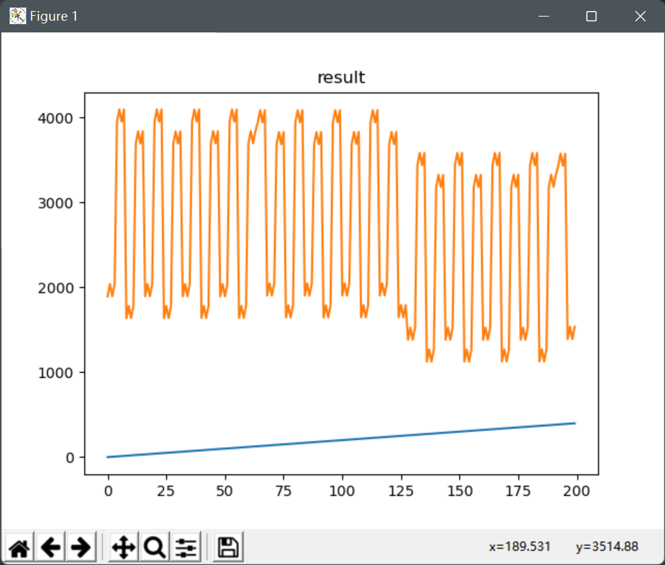

# Gatenetwork
## Basic idea
We all know that the computer was consisted of logic gate and other micro electronics. 
From the simplest calculator to the complex operating system can all be implemented by 
using the arrangement of logic gate. Hence, I assume that, if there is a complex and correct enough logic gate network,
the output may be fit the actual output better. The simplest example is the summing circuit: 
giving two number and get the sum of them. 
Maybe program can also generate these logic gate network after many times training.

GateGraph uses number 0~15 to represent 16 kinds of logic gate and link them to generate a digraph.
The whole network get an int number, transfer it to binary number, and get an output of the graph.
In the graph, 
each node contains a number to represent logic gate with only 2 input linkage and unlimited output linkage.

Currently, I only implement generate gate graph and calculate graph. 
Maybe I will implement the optimization function of the graph to make the output fit the real value in the future.

## Quick start
Open GateGraph.py and run the main.

See more details and annotations in the resource code since this is not a huge project, 
and the whole structure is really simple.

At the beginning, each node will generate logic graph randomly. The graph, therefore, 
may give different output based on the different logic gate and linkage.

Here is an example.
The gate graph

I use a y=2x as input function, shown as blue line at the figure.

And the red one is the output of gate network

Based on the random generate mechanism, the result figure may quite different even the input function is the same.

## Unfinished function
GateGraphOptimizer: optimize the logic gate and the linkage of the graph 
to make the output fit the sample output better.

Some heuristic search algorithm, suck as GA or PSO, to optimize the parameter of the gate graph or even the optimizer,
enabling generator and optimizer to achieve more complex gate network. 
After that, the output may be more smooth and accurate
## libraries
networkx 2.6.3

pandas 1.1.5

---
Any ideas or bug feedback at the issue are appreciated.

:)
